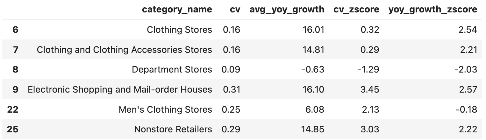

# Retail and Food Services Analysis: 2017–2023 MRTS
## Project Background
The Monthly Retail Trade Survey (MRTS) provides insights into the economic activity of the retail and food services industries. Using a stratified random sample of approximately 4,800 firms, it estimates monthly sales for over three million businesses nationwide. These estimates are weighted and benchmarked to reflect the full scope of the industries.

This project analyzes MRTS data from 2017 to 2023, focusing on sales trends, industry performance, and the impact of major economic events, such as the COVID-19 pandemic. The findings aim to inform decision-making for businesses, policymakers, and researchers.

To complement the MRTS data, this analysis incorporates **Consumer Price Index (CPI)** data from the **Bureau of Labor Statistics (BLS)**. The CPI dataset provides a measure of inflation, allowing for the adjustment of nominal sales to constant dollars. This enables a clearer understanding of real sales trends by accounting for changes in purchasing power over time.

  

More about the data used

The main data was retrieved from the Census Bureau's Monthly Retail Trade Survey (MRTS) API. 

- **API Call Construction**: A Python script was used to query the API with parameters specifying the data type, time range (2017–2023). Both seasonally adjusted and unadjusted metrics are retrieved.
- **Data Handling**: The API response was parsed and transformed into a structured format (CSV) for further analysis.

> The Python script used for this process is available [here](scripts/fetch_data.py).

The secondary data was retrieved via [BLS CPI Supplemental Files](https://www.bls.gov/cpi/tables/supplemental-files/).

Detailed cleaning for the data can be found [here](notebooks/retail-and-food-analysis.ipynb##CPI-Data-Cleaning).

**Work Flow**:

**Part 1: Exploration and Cleaning**

The raw data was explored and cleaned using Python to ensure accuracy and relevance for further analysis.

**Part 2: Insights**

SQL queries were employed to extract actionable insights tailored for relevant business stakeholders.

Business questions and specific sql queries can be found [here](queries/queries.sql)

**Part 3: Visualizations**

Python charts and Tableau were used to create explorative visualizations and an interactive dashboard, designed primarily to easily monitor key metrics.
> **Note**: Some visualizations were performed early in the process to better understand the data and guide insight generation.
> 
> Tableau Visualizations are available [here](https://public.tableau.com/views/RetailSales_17359945353730/Dashboard1?:language=en-US&:sid=&:redirect=auth&:display_count=n&:origin=viz_share_link).
> 
**Part 4: Recommendations & Next Steps**

Based on the findings, recommendations are proposed for future strategies and further exploration.

---

Here is the Entity Relationship Diagram:

  

## Insights

### Sale Trends and Growth Rates

  

- Total **Retail Trade and Food Services** averages **$568,936.30** in monthly sales, contributing to **$6,827,235.57 annually**.  
- The top categories are **"Motor Vehicle and Parts Dealers"**, **"Food and Beverage Stores"**, **"Food Services and Drinking Places"**, **"General Merchandise Stores"**, and **"Nonstore Retailers"**.
- **Seasonality and Trends**:  
  Sale trends from **2017 to 2023** exhibit clear **seasonal patterns** across multiple categories. Below is an analysis of these patterns for some of these categories, supported by seasonal decomposition:
  

  

  

Plot Details

Clearer visualizations can be found [here](notebooks/retail-and-food-analysis.ipynb##CPI-Data-Cleaning)

- The general category of **Retail Trade** shows steady and consistent upward trend over the years, reflecting the resilience and growth of the overall retail sector. It exhibits clear seasonality, with peaks occurring annually in November and December during holiday shopping periods, such as Black Friday and Christmas. These peaks have grown in magnitude over time, suggesting stronger consumer spending during these periods. Most fluctuations in this category are well-accounted for by the trend and seasonal components, with small and random residuals indicating limited unexplained variability.
  - **Food Services and Drinking Places**: Separating Food Services and Drinking Places separately, noticed that seasonality component shows peaks in summer months. This likely reflects the preference of dining out during vacations and warm weather.
  - **Nonstore Retailers**: Nonstore Retailers show a strong and sustained upward trend, highlighting the rapid expansion of e-commerce, particularly in the post-pandemic era. Sales consistently peak in November and December, driven by holiday shopping and promotional events like Cyber Monday. The seasonal troughs in January and February align with a post-holiday spending slowdown as consumers adjust their budgets. The small residuals indicate that the identified trends and seasonal patterns capture the majority of the variability in this category, underscoring its stability and consistent growth.
  - **Gasoline Stations**: Gasoline Stations display an irregular trend influenced by economic disruptions. Seasonal peaks consistently occur during the summer months (June to August), most likely driven by increased travel and vacation activity, while troughs are observed in the colder months of January and February when travel activity is typically reduced. Relatively larger residuals in this category reflect the influence of external factors such as fluctuating gas prices, economic conditions, and geopolitical events, which contribute to greater variability in this sector compared to others.
  - **Clothing and Accessories Stores**: Similar to other categories, seasonal peaks are observed in November and December, driven by holiday shopping, while secondary peaks in April and May likely reflect spring collections, Easter shopping, and pre-summer purchases. Sales typically decline in January and February, mirroring post-holiday spending adjustments.

### COVID Trends and Recovery
- In 2018 and 2019, there was YoY growth of **+4.33% and +3.11%** in Total Retail Trade and Food Services, with annual sales of **$5,985,551 in 2018** and **$6,171,969 in 2019**. However, with the onset of COVID-19, YoY growth in 2020 declined to only **+0.76%**.
- Retail Trade experienced YoY growth of **+4.17% in 2018**, **+2.77% in 2019**, and **+3.03% in 2020**.
- Food Services showed YoY growth of **+5.53% in 2018** and **+5.62% in 2019**, but dropped sharply to **-15.08% in 2020**. Compared to the retail categories in the MARTS dataset, food services experienced a significantly larger decline in the COVID-19 year of 2020. This can be attributed to government restrictions, reduced social interactions, and changing consumer behavior.  
  - Interestingly, the category rebounded significantly in 2021 (**+28.5%**) and continued growing in subsequent years (**+16.1% in 2022**, **+11.9% in 2023**).  
  - This recovery likely reflects:
    - Consumers seeking more social interactions and leisure activities post-pandemic.
    - A shift toward "revenge spending" after prolonged restrictions.
    - The resumption of major events and gatherings.
      

  

- **Categories Most Negatively Impacted During COVID**:  
  Several categories experienced significant declines in 2020, including:
  - **Clothing and Accessories Stores**: Sales dropped **-24.5% in 2020**, likely due to reduced demand for apparel as social activities were restricted and work-from-home trends increased.
  - **Electronics and Appliance Stores**: Sales fell by **-18.4% in 2020**. While demand for small electronics (e.g., laptops) may have surged during the pandemic, the overall category struggled due to supply chain disruptions and reduced demand for big-ticket appliances.
  - **Department Stores**: Sales decreased by **-16.0% in 2020**, reflecting the challenges faced by traditional brick-and-mortar stores as consumers shifted to e-commerce.
  - **Gasoline Stations**: Sales dropped by **-16.2% in 2020** due to reduced travel and commuting during lockdowns.

- **Categories with Increased Sales During COVID**:  
  While many categories struggled during COVID, some saw positive growth:
  - **Grocery Stores**: Sales grew by **+9.1% in 2020**, driven by increased at-home cooking during lockdowns. This growth exceeded pre-COVID YoY growth rates of **+2.78% in 2018** and **+3.35% in 2019**, indicating a potential long-term shift toward at-home cooking.
  - **Nonstore Retailers**: Sales increased significantly by **+30.3% in 2020**, driven by the rapid adoption of e-commerce as consumers avoided in-person shopping. The category has continued to grow strongly post-pandemic, suggesting a permanent shift in consumer behavior.
  - **Food and Beverage Stores**: Similar to Grocery Stores, this category saw sales grow by **+9.3% in 2020** due to higher consumer spending on groceries. Growth continued in subsequent years.
  - **Building Material and Garden Equipment and Supplies Dealers**: Sales increased by **+12.3% in 2020**, driven by increased interest in home improvement and gardening projects during lockdowns. Growth continued into 2021 (**+14.7%**) but stabilized and slightly declined in 2023 (**-3.1%**).

- **Categories Struggling to Recover Post-COVID**:  
  While some categories have rebounded, others continue to face challenges:
  - **Department Stores**: This category was already under pressure before COVID, with sales declining from **$146,693 in 2017** to **$134,893 in 2019** (**-8% over two years**). Sales dropped by **-16% in 2020**, followed by a modest recovery (**+17.6% in 2021**), but plateaued in 2022 (**+2.3%**) and declined in 2023 (**-2.3%**).  
    - Likely reasons include increasing competition from e-commerce and specialty retailers, as well as changing consumer shopping habits.
  - **Electronics and Appliance Stores**: Sales had already declined slightly pre-COVID, from **$92,546 in 2017** to **$90,962 in 2019** (**-1.7%**), reflecting competition from online marketplaces like Amazon and Best Buy. The category experienced a sharp decline of **-18.4% in 2020**, followed by limited recovery (**+27.3% in 2021**) and slight declines in both 2022 (**-1.2%**) and 2023 (**-1.2%**).  
    - Supply chain disruptions, inflation, and shifting consumer priorities have likely contributed to this slow recovery.

  

### Market Risks
The **Coefficient of Variation (CV)** is a powerful metric for assessing market risks and volatility, particularly in retail sales. By calculating CV from seasonally unadjusted MRTS monthly sales data, the analysis retains the natural variability of the market, enabling a deeper understanding of the risks faced by different categories. CV highlights how much sales fluctuate relative to their average, making it a suitable tool to identify categories with high volatility.

  

- **Categories with the Highest CV**
  - **Nonstore Retailers (CV = 0.29)**: 
    This category exhibits the highest CV, reflecting rapid growth and susceptibility to variability. It highlights the ongoing e-commerce trend and the dynamic nature of this category.
  - **Food Services and Drinking Places (CV = 0.19):**  
    Volatility in this category can be attributed to seasonality (e.g., holidays and summer months) and external factors like the pandemic.
  - **Clothing and Clothing Accessories Stores (CV = 0.16)**:  
    This category is driven by seasonal trends, fashion cycles, and discretionary spending, making it prone to fluctuations.

- **Correlation Between CV and YoY Growth**
  - High CV does not necessarily imply negative growth. Categories with high CV can still experience significant growth.
  - **Results:**  
    - **Correlation Coefficient = 0.67**, **P-value ≈ 0.0000**  
      This strong positive correlation suggests that categories with higher volatility also tend to exhibit higher growth rates on average. This aligns with the notion that rapidly evolving or high-risk markets, such as e-commerce, are often associated with high growth.

- **Outlier Analysis: Z-Scores for CV and YoY Growth**
  - To further investigate the relationship between CV and YoY growth, Z-scores were calculated for both metrics to identify outliers. Categories with Z-scores exceeding ±2 were flagged as significant outliers.

  

- **High Growth and High Volatility Categories:**
      - **Nonstore Retailers:**  
        This category is a standout, with significant variability and exceptional growth. Stakeholders should focus on investments in logistics, supply chain resilience, and scalability to manage demand spikes and sustain growth.
      - **Electronic Shopping and Mail-order Houses:**  
        A subset of Nonstore Retailers, this category also demonstrates the highest volatility and growth, further emphasizing the need for robust e-commerce infrastructure.
    - **Declining Categories:**
      - **Department Stores:**  
        With negative YoY growth and relatively low CV, this category is experiencing stagnation and contraction. Strategic restructuring is necessary to address ongoing challenges.
      - **Clothing Stores:**  
        While the CV Z-score is close to the average, the Z-score for YoY growth is significantly above 2, indicating strong positive growth relative to other categories. This suggests rapid recovery or expansion compared to the overall market.

  

The **Consumer Price Index (CPI)** is a measure of the average change over time in the prices paid by consumers for goods and services. It is published by the **Bureau of Labor Statistics (BLS)** and is widely used to track inflation. The CPI is standardized to a base year (e.g., 1982-1984 = 100) and reflects price changes relative to this base period.

To account for inflation and express sales in terms of constant dollars, the following formula was used:

Inflation-Adjusted Sales = (Monthly Sales / CPI Index  for all items) * 100

- **Inflation's Impact Across Categories**
  - **Nonstore Retailers** show the largest percent difference of **-63.29%**, indicating that inflation significantly affects their nominal growth when adjusted for constant dollars.
  - However:
  - Comparing this with **Department Stores** (percent difference of **-62.49%**, the least impacted category), the differences are marginal.
  - This suggests that while inflation-adjusted sales of **Nonstore Retailers** appear to have been impacted, the minimal spread between categories supports the notion that **Nonstore Retailers** have experienced real growth, driven by the ongoing shift toward e-commerce.
  - While all categories exhibit significant negative percent differences due to inflation, the relatively uniform impact suggests that the inflationary pressure is systemic rather than category-specific.
  - Categories like **Food Services and Drinking Places** and **Gasoline Stations** also exhibit large percent differences (**-63.01%** and **-62.95%**, respectively), likely influenced by broader economic and consumer spending trends.

## Recommendations & Next Steps

### Corporate Executives
  - **Prioritize E-commerce Investments**  
  Nonstore Retailers have shown significant growth and volatility, driven by the shift toward e-commerce. Expanding online capabilities and improving logistics infrastructure can help sustain this momentum.
  - **Focus on At-Risk Categories**  
  Categories like **Department Stores** and **Electronics and Appliance Stores** are underperforming. Consider strategies to diversify revenue, such as transitioning to online channels, introducing new product lines, or restructuring operations. 
### Sales and Marketing Teams
  - **Leverage Seasonality for Campaigns**  
  Categories like **Clothing and Accessories Stores** and **Gasoline Stations** have distinct seasonal sales patterns. Focus marketing efforts during peak periods, such as holiday shopping or summer months, to maximize revenue.  
  - **Capitalize on Post-COVID Recovery**  
  The strong recovery in categories like **Food Services and Drinking Places** presents opportunities for targeted promotions and loyalty programs. Highlight social and experiential aspects of these categories to align with shifting consumer preferences.  
  - **Emphasize Value During Inflation**  
  With inflation impacting purchasing power, marketing campaigns should emphasize affordability and long-term value, particularly in essential categories like **Food and Beverage Stores**.
### Supply Chain and Operations Teams
  - **Scale for High-Volatility Categories**  
  The growth in **Nonstore Retailers** and other high-volatility categories requires enhanced scalability. Invest in forecasting tools and improve supply chain flexibility to handle demand spikes effectively.  
  - **Align Inventory with Seasonal Peaks**  
  For categories with clear seasonality, such as **Clothing and Accessories Stores**, optimize inventory planning to meet demand during peak periods and reduce excess stock during slower months.  
  - **Mitigate Inflationary Challenges**  
  Strengthen supplier relationships to manage cost pressures and ensure consistent supply, particularly for categories like **Building Materials** that are more affected by inflation.

